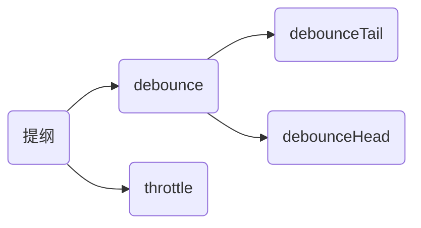

---
tags:
- 防抖
- 节流
- 限频
---

# debounce vs throttle



## 概念
- **连续操作**：两个操作之间的时间间隔小于设定的阈值，这样子的一连串操作视为连续操作。
- **debounce（防抖）**：一个连续操作中的处理，只触发一次，从而实现防抖动。
- **throttle（限频/节流）**：一个连续操作中的处理，按照阈值时间间隔进行触发，从而实现节流。

  
图1 debounce、throttle运行图

如图所示，其中delay=4，由于红色操作序列与绿色操作序列之间的时间**间隔小于delay**，所以这两个序列被视为一个连续操作行为。

- debounceTail：执行操作在连续操作完成之后，触发；
- debounceStart：执行操作在连续操作完成之前，触发；
- throttle：在一个连续操作行为中，每间隔delay的时间触发1次。

结合运行图，可以更好的理解debounce、throttle的作用。

## 常用情景

- scroll事件：当页面发生滚动时，scroll事件会被频繁的触发，1s触发可高达上百次。在scroll事件中，如果有复杂的操作（特别是影响布局的操作），将会大大影响性能，甚至导致浏览器崩溃。所以，对其进行防抖、限频很重要。
- click事件：用户进行click事件时，有可能连续触发点击（用户本意并非双击）。该操作有可能是不小心多次连续点击，也可能是页面状况不好的情况下，期待尽快得到反馈的有意行为；但这样的操作，反而会加剧性能问题，因此也有必要考虑防抖、限频。
- input事件：如sug等需要通过ajax及时获得数据的情况，需要进行限频，防止频繁的请求发生，减少服务器压力的同时，提高页面响应性能。
- touchmove事件：同scroll事件类似。

还有许多其他业务场景会出现频繁操作的情况，不一一列举。debounce可用于：防止用户的多次click提交；scroll下拉刷新时，同一位置多次请求数据等。throttle可应用于，scroll设置定位等的频繁位置计算；拖拽的频繁位置计算等。

## 怎样实现

```js
// 防抖 且首次执行
// 采用原理：第一操作触发，连续操作时，最后一次操作打开任务开关（并非执行任务），任务将在下一次操作时触发）
function debounceStart(fn, delay, ctx) {
    let immediate = true 
    let movement = null
    return function() {
        let args = arguments
        
        // 开关打开时，执行任务
        if (immediate) {
            fn.apply(ctx, args)
            immediate = false
        }
        // 清空上一次操作
        clearTimeout(movement)
        
        // 任务开关打开
        movement = setTimeout(function() {
            immediate = true
        }, delay)
    }
}

// 防抖 尾部执行
// 采用原理：连续操作时，上次设置的setTimeout被clear掉
function debounceTail(fn, delay, ctx) {
    let movement = null
    return function() {
        let args = arguments
        
        // 清空上一次操作
        clearTimeout(movement)
        
        // delay时间之后，任务执行
        movement = setTimeout(function() {
            fn.apply(ctx, args)
        }, delay)
    }
}

// 限频，每delay的时间执行一次 
function throttle(fn, delay, ctx) {
    let isAvail = true
    return function() {
        let args = arguments
        
        // 开关打开时，执行任务
        if (isAvail) {
            fn.apply(ctx, args)
            isAvail = false
            
            // delay时间之后，任务开关打开
            setTimeout(function() {
                isAvail = true
            }, delay)
        }
    }
}
	
// 调用
btn.onclick = debounceStart(function(event) {
    console.log('100ms')
}, 100, this) 
window.onscroll = throttle(function(event) {
    console.log('100ms')
}, 100, this) 
```

如上代码，使用了闭包，将isAvail等父级变量存储在了内存当中，实现状态切换。同时，通过apply将任务函数的上下文ctx（在类、对象内操作时，其作用更明显）；参数arguments（如调用中的event），存入最终的任务执行函数当中。通过timer的clear和set来控制任务的触发，同时需留意任务执行与任务开关打开的区别。任务执行是timer到达，就将触发任务；任务开关打开是timer到达时，只将状态变更，需要用户的再一次操作，才能实施真正的任务触发。

通过控制台可以看到，不进行限频时，scroll在1s内可以触发高达上100次，增加了限频之后，就将scroll的触发控制在一定的范围内。

## 增强


图2 throttle运行标示图

在实际的使用场景当中，我们会发现，用户最后一次操作并没有后续的处理，也就是最后一次操作的状态将丢失。在某些应用场景当中，可能造成状态处理不准确。如通过scroll事件判断是否到达页面底部，如果到达，则提示用户。使用throttle方法进行节流，在到达底部之前，小于delay的时间间隔内，触发了一次位置判断操作；下一次触发将在delay时间之后，但在那之前，scroll事件已经结束了，所以无法获取最后scroll到底部的位置，也就不会触发提示。

如何优化呢？
可以结合debounceTail的功能，其可以实现最后一次操作的捕捉，如图所示：


图3，throttle加强运行图

其代码如下：

```js
// 限频，每delay的时间执行一次
function throttle(fn, delay, ctx) {
    let isAvail = true
    let count = false
    let movement = null
    return function() {
        count = true
        let args = arguments
        if (isAvail) {
            fn.apply(ctx, args)
            isAvail = false
            count = false
            setTimeout(function() {
                isAvail = true
            }, delay)
        }
        if (count) {
            clearTimeout(movement)
            movement = setTimeout(function() {
                fn.apply(ctx, args)
            }, 2 * delay)
        }
    }
}
```

增加movement来记录和清除最终操作状态；用count来避免与限频的重合；如此便实现了捕获最终操作状态的限频操作。

**tips：其中大量使用setTimeout()的操作，在高级浏览器中，可以使用requestAnimationFrame来替代setTimeout操作，从而提高性能。requestAnimationFrame的原理、优势及低版本的兼容，可以查阅张鑫旭的博客，写得很详细：[CSS3动画那么强，requestAnimationFrame还有毛线用？](http://www.zhangxinxu.com/wordpress/2013/09/css3-animation-requestanimationframe-tween-动画算法/)**
