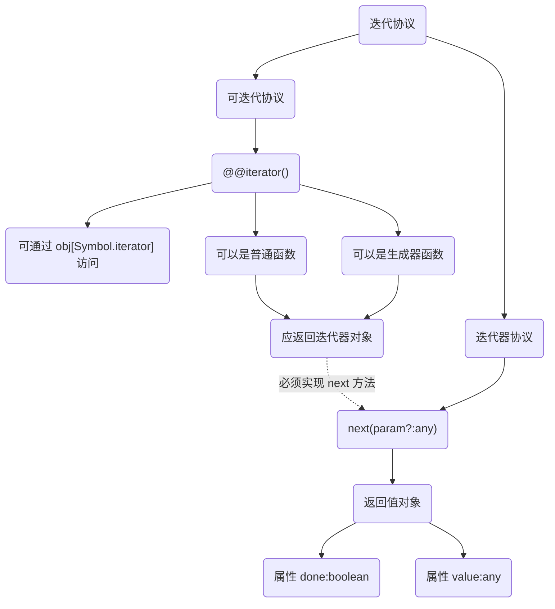

---
tags:
- 可迭代协议
- 迭代器协议
---

# 迭代协议

```mermaid
graph
A(迭代协议)-->B(可迭代协议)-->C(&#64&#64iterator&#40&#41)
                           C-->D(可通过 obj&#91Symbol.iterator&#93 访问)
                           C-->D1(可以是普通函数)-->E2(应返回迭代器对象)
                           C-->D2(可以是生成器函数)-->E2
                                                   E2-.->|必须实现 next 方法|C1
        A-->B1(迭代器协议)-->C1(next&#40param?:any&#41)-->D3(返回值对象)
                                                    D3-->E(属性 done:boolean)
                                                    D3-->E1(属性 value:any)
```
